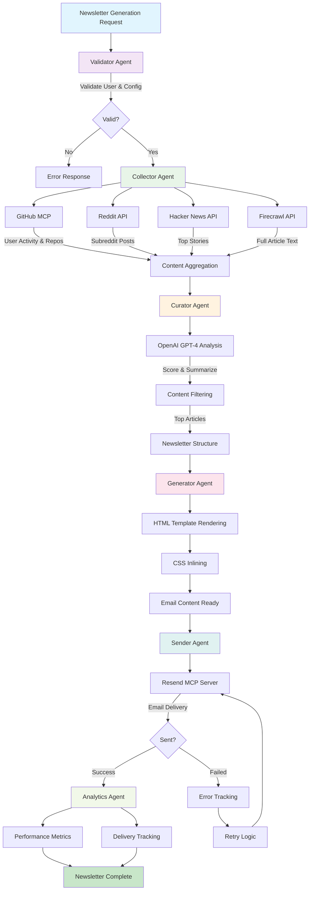

# Personal AI Newsletter Generator

An AI-powered newsletter system that helps curate personalized content from multiple sources and delivers formatted emails using content analysis.

## Features

- 🤖 **AI-Powered Curation**: Uses OpenAI GPT-4 for content analysis and relevance scoring
- 📧 **Email Delivery**: Integrates with Resend for email delivery with responsive HTML templates
- 🔗 **Multi-Source Content**: Collects content from GitHub, web sources, and popular platforms
- 📊 **Analytics**: Tracks delivery status and basic performance metrics
- 🛡️ **Error Handling**: Includes rate limiting and fallback mechanisms
- 📱 **Mobile-Friendly**: Responsive email templates that work across email clients
- 🎯 **Personalization**: Filters content based on user interests and preferences
- 🏗️ **Workflow Management**: Uses LangGraph for multi-stage content processing

## Architecture

Built with a layered architecture using LangGraph workflow orchestration:

- **Workflow Pipeline**: 6-stage process (Validator → Collector → Curator → Generator → Sender → Analytics)
- **Service Integration**: Combines MCP servers (GitHub/Resend) with direct APIs (Firecrawl/Reddit/HackerNews)
- **AI Analysis**: Uses OpenAI GPT-4 for content scoring and summarization
- **Async Processing**: Python async infrastructure with rate limiting and error handling

### Workflow Stages



#### Workflow Details

1. **Validator Agent**: User input validation and configuration verification
2. **Collector Agent**: Parallel content collection from multiple sources
   - GitHub MCP: User activity and repository data
   - Reddit API: Posts from relevant subreddits
   - Hacker News API: Top stories and trending content
   - Firecrawl API: Full-text extraction from web articles
3. **Curator Agent**: AI-powered content analysis and newsletter curation
   - OpenAI GPT-4 scoring based on user interests
   - Content relevance assessment and ranking
   - Article summarization and key insights extraction
4. **Generator Agent**: HTML email generation with responsive design
   - Jinja2 template rendering with user personalization
   - CSS inlining for email client compatibility
   - Mobile-responsive layout optimization
5. **Sender Agent**: Email delivery via Resend MCP server
   - Professional email formatting and headers
   - Delivery tracking and error handling
   - Retry logic for failed deliveries
6. **Analytics Agent**: Performance tracking and metrics collection
   - Processing time measurements
   - Content source effectiveness analysis
   - User engagement and delivery statistics

## Quick Start

### Prerequisites

- **Python 3.11+**
- **Node.js 18+** (for official MCP servers)
- **Docker** (for GitHub MCP server)
- **uv** (Python package manager) - Install with: `curl -LsSf https://astral.sh/uv/install.sh | sh`

### Installation

1. **Clone the repository**
   ```bash
   git clone <repository-url>
   cd Personal-AI-Newsletter
   ```

2. **Install Python dependencies**
   ```bash
   uv sync
   ```

3. **Set up MCP servers**
   ```bash
   # Pull GitHub MCP Docker image
   docker pull ghcr.io/github/github-mcp-server

   # Set up Resend MCP server (clone and build locally)
   git clone https://github.com/resend/mcp-send-email.git mcp-servers/resend
   cd mcp-servers/resend
   npm install
   npm run build
   cd ../..
   ```

4. **Configure environment variables**
   ```bash
   # Create .env file with your API keys (see Configuration section)
   touch .env
   # Add required environment variables
   ```

5. **Initialize the database and setup**
   ```bash
   uv run python -m src.main setup
   ```

### Basic Usage

**Generate a newsletter**
```bash
uv run python -m src.main generate --user your_user_id
```

**Dry run (generate without sending)**
```bash
uv run python -m src.main generate --user your_user_id --dry-run
```

**List configured users**
```bash
uv run python -m src.main list-users
```

**Test system configuration**
```bash
uv run python -m src.main test-config
```

## Configuration

Create a `.env` file in the project root with the following variables:

### Required API Keys

```bash
# OpenAI for content analysis and personalization
NEWSLETTER_OPENAI_API_KEY=sk-...

# Resend for email delivery (MCP server)
NEWSLETTER_RESEND_API_KEY=re_...

# Firecrawl for web content extraction (direct API)
NEWSLETTER_FIRECRAWL_API_KEY=fc-...

# GitHub for repository content (MCP server)
NEWSLETTER_GITHUB_TOKEN=ghp_...

# Your domain for email sending (optional - leave empty for development)
# If not set, emails will be sent from onboarding@resend.dev (test email)
NEWSLETTER_DOMAIN=yourdomain.com
```

### External Service Configuration

The system uses a hybrid approach with MCP servers and direct APIs:

#### 1. **Resend MCP Server** - Email Delivery
- **Repository**: https://github.com/resend/mcp-send-email
- **Setup**: Clone and build locally (see installation steps)
- **API Key**: Get from https://resend.com/api-keys
- **Domain**: Configure sending domain in Resend dashboard (optional)
  - **Without custom domain**: Emails sent from `onboarding@resend.dev` (development/testing)
  - **With custom domain**: Emails sent from `newsletter@yourdomain.com` (production)

#### 2. **Firecrawl API** - Web Content Extraction
- **Direct API Integration**: No MCP server required
- **API Key**: Get from https://firecrawl.dev/app/api-keys
- **Features**: Full-text content extraction from URLs with rate limiting

#### 3. **GitHub MCP Server** - Repository Content & Activity
- **Docker Image**: `ghcr.io/github/github-mcp-server`
- **Installation**: `docker pull ghcr.io/github/github-mcp-server`
- **Token**: GitHub Personal Access Token with repo permissions
- **Setup**: https://github.com/settings/tokens

### User Configuration

Configure user profiles in `src/infrastructure/database.py` or via the setup wizard:

```python
UserProfile(
    user_id="1f51c4f3-5d6c-42e8-a693-35a0262aabdd",
    name="Your Name",
    email="your@email.com",
    interests=["AI", "Computer Vision", "Machine Learning"],
    max_articles=10,
    timezone="UTC",
    schedule_time="07:00",
    content_sources=["reddit", "github", "hacker_news"]
)
```

## API Keys Setup Guide

### 1. OpenAI API Key
1. Visit https://platform.openai.com/api-keys
2. Create new secret key
3. Add to `.env` as `NEWSLETTER_OPENAI_API_KEY=sk-...`

### 2. Resend API Key & Domain (Optional)

**Option 1: Development Mode (No Domain Required)**
1. Sign up at https://resend.com
2. Go to API Keys → Create API Key
3. Add to `.env`: `NEWSLETTER_RESEND_API_KEY=re_...`
4. Leave `NEWSLETTER_DOMAIN` empty or omit it
5. Emails will be sent from `onboarding@resend.dev` (Resend's test email)

**Option 2: Production Mode (Custom Domain)**
1. Sign up at https://resend.com
2. Go to API Keys → Create API Key
3. Go to Domains → Add Domain (e.g., yourdomain.com)
4. Add DNS records as instructed by Resend
5. Add to `.env`: 
   - `NEWSLETTER_RESEND_API_KEY=re_...`
   - `NEWSLETTER_DOMAIN=yourdomain.com`
6. Emails will be sent from `newsletter@yourdomain.com`

### 3. Firecrawl API Key
1. Sign up at https://firecrawl.dev
2. Go to API Keys → Generate new key
3. Add to `.env` as `NEWSLETTER_FIRECRAWL_API_KEY=fc-...`

### 4. GitHub Personal Access Token
1. Go to https://github.com/settings/tokens
2. Generate new token (classic) with `repo` permissions
3. Add to `.env` as `NEWSLETTER_GITHUB_TOKEN=ghp_...`

## Project Structure

```
Personal-AI-Newsletter/
├── src/
│   ├── agents/                    # LangGraph workflow agents
│   │   ├── validator.py          # User input validation
│   │   ├── collector.py          # Content collection via APIs/MCP
│   │   ├── curator.py            # AI-powered curation
│   │   ├── generator.py          # Email generation
│   │   ├── sender.py             # Email delivery
│   │   ├── analytics.py          # Performance tracking
│   │   └── error_handlers.py     # Workflow error handling
│   ├── infrastructure/           # Core infrastructure
│   │   ├── mcp_clients/          # MCP server clients
│   │   │   ├── base.py           # Base MCP client
│   │   │   ├── resend_client.py  # Resend email delivery
│   │   │   └── github_client.py  # GitHub integration
│   │   ├── api_clients/          # Direct API clients
│   │   │   ├── firecrawl_api.py  # Firecrawl web extraction
│   │   │   └── rate_limiter.py   # Rate limiting utilities
│   │   ├── error_handling.py     # Unified error handling
│   │   ├── database.py           # SQLite async database
│   │   ├── config.py             # Environment configuration
│   │   └── logging.py            # Structured logging
│   ├── models/                   # Data models & validation
│   │   ├── content.py            # Content models & scoring
│   │   ├── user.py               # User profiles & preferences
│   │   ├── email.py              # Email content models
│   │   └── state.py              # LangGraph workflow state
│   ├── services/                 # Business logic services
│   │   ├── openai_service.py     # GPT-4 content analysis
│   │   ├── curation.py           # Newsletter curation engine
│   │   ├── email_generation.py   # HTML email generation
│   │   ├── content_collection.py # Multi-source content aggregation
│   │   ├── notification.py       # Email delivery service
│   │   └── user_profile.py       # User management service
│   ├── workflows/                # LangGraph workflow definitions
│   │   └── newsletter.py         # Main workflow orchestration
│   ├── main.py                   # CLI entry point
│   └── setup.py                  # Setup wizard
├── mcp-servers/                  # MCP servers
│   └── resend/                   # Cloned Resend MCP server
├── templates/
│   └── email/                    # Jinja2 email templates
│       └── newsletter.html       # Main email template
├── config/                       # Configuration files
│   └── mcp_servers.json          # MCP server configurations
├── logs/                         # Application logs
├── .env                          # Environment configuration
└── pyproject.toml               # Python dependencies
```

## Advanced Configuration

### Content Source Configuration

Content sources can be configured per-user in the user profile:

```python
# Available content sources
CONTENT_SOURCES = {
    "reddit": {
        "subreddits": ["MachineLearning", "artificial", "ComputerVision"],
        "max_items": 20
    },
    "github": {
        "trending": True,
        "languages": ["python", "javascript"],
        "max_repos": 10
    },
    "hacker_news": {
        "top_stories": True,
        "max_items": 15
    }
}
```

### Email Template Customization

Email templates use Jinja2 with CSS inlining for maximum email client compatibility:

```html
<!-- templates/email/newsletter.html -->
<div class="section">
    <h2>{{ section.emoji }} {{ section.title }}</h2>
    
        <div class="article">
            <h3><a href="{{ article.content_item.url }}">{{ article.content_item.title }}</a></h3>
            <p>{{ article.ai_summary }}</p>
        </div>
    
</div>
```

### Performance Optimization

The system includes several performance optimizations:

- **Parallel Content Collection**: Multiple MCP servers run concurrently
- **Async Database Operations**: Non-blocking SQLite with aiosqlite
- **Intelligent Caching**: Content analysis results cached to reduce OpenAI API calls
- **Batch Processing**: Multiple articles analyzed in single OpenAI API calls

## System Requirements & Performance

### Minimum Requirements
- **CPU**: 2 cores, 2.0 GHz
- **RAM**: 4GB
- **Storage**: 1GB free space
- **Network**: Stable internet connection

### Performance Notes
- **Newsletter Generation**: Typically 45-60 seconds for 20 articles
- **Content Collection**: Usually 3-5 seconds with parallel API calls
- **AI Analysis**: Around 30-40 seconds for OpenAI processing
- **Email Generation**: About 1-2 seconds for template rendering
- **Email Delivery**: Usually under 1 second via Resend

### Scalability Notes
- **Content Sources**: Designed to accommodate additional MCP servers
- **AI Analysis**: Uses batch processing to help manage API costs
- **Email Delivery**: Includes basic delivery tracking
- **Database**: Currently uses SQLite (suitable for personal use)

## Production Deployment

### Environment Setup
```bash
# Production environment variables
NEWSLETTER_LOG_LEVEL=INFO
NEWSLETTER_LOG_FORMAT=structured
NEWSLETTER_DATABASE_URL=sqlite:///prod_newsletter.db
NEWSLETTER_REQUEST_TIMEOUT=30
NEWSLETTER_RETRY_ATTEMPTS=3
```

### Monitoring & Alerting
The system provides comprehensive logging and metrics:

```json
{
  "level": "info",
  "event": "Newsletter generated successfully",
  "user_id": "...",
  "processing_time": 48.99,
  "articles_count": 2,
  "delivery_success": true,
  "timestamp": "2025-09-28T14:50:55.408176Z"
}
```

### Security Best Practices
- **API Key Rotation**: Regularly rotate all API keys
- **Environment Isolation**: Use separate API keys for dev/prod
- **Access Control**: Limit GitHub token permissions to minimum required
- **Email Security**: Use DKIM/SPF records for domain authentication
- **Data Protection**: Content is processed but not permanently stored

## Troubleshooting

### Common Issues

#### 1. MCP Server Connection Issues
```bash
# Check MCP server status
uv run python -m src.main test-mcp

# Common fixes:
# - Verify API keys in .env file
# - Check Docker daemon is running (for GitHub MCP)
# - Ensure Node.js packages are installed globally
# - Verify network connectivity
```

#### 2. Email Delivery Failures
```bash
# Test email configuration
curl -X POST 'https://api.resend.com/emails' \
  -H 'Authorization: Bearer YOUR_API_KEY' \
  -H 'Content-Type: application/json' \
  -d '{"from": "newsletter@yourdomain.com", "to": ["test@example.com"], "subject": "Test", "text": "Test email"}'

# Common fixes:
# - Verify domain DNS records in Resend dashboard
# - Check API key permissions
# - Validate from_email domain ownership
```

#### 3. Content Quality Issues (Empty Newsletters)
```bash
# Check content filtering thresholds
# Current thresholds (in src/models/content.py):
# - composite_score >= 0.2
# - quality_score >= 0.2 (or 0.5 default)

# Check OpenAI API status and quotas
# Review content analysis logs for relevance scores
```

#### 4. OpenAI API Issues
```bash
# Test OpenAI connection
curl https://api.openai.com/v1/models \
  -H "Authorization: Bearer YOUR_API_KEY"

# Common fixes:
# - Check API key validity and quotas
# - Verify billing account status
# - Check rate limits
```

### Debug Commands

```bash
# Enable verbose logging
NEWSLETTER_LOG_LEVEL=DEBUG uv run python -m src.main generate --user your_user_id

# Test individual components
uv run python -m src.main test-config     # Test configuration
uv run python -m src.main test-mcp        # Test MCP servers
uv run python -m src.main test-openai     # Test OpenAI connection

# Check logs
tail -f logs/newsletter.log

# Validate email templates
uv run python -c "from src.services.email_generation import EmailGenerationService; print('Templates OK')"
```

### Performance Issues

If newsletter generation takes too long:

1. **Reduce content analysis batch size**
2. **Implement content caching** for repeated analyses
3. **Use OpenAI batch API** for cost optimization
4. **Optimize content collection** by disabling slow sources

### Getting Help

1. **Check logs**: `logs/newsletter.log` contains detailed error information
2. **Test components**: Use individual test commands to isolate issues
3. **Review configuration**: Ensure all API keys and domains are properly configured
4. **Monitor resources**: Check OpenAI quotas and Resend limits

## Development & Contributing

### Development Setup
```bash
# Install development dependencies
uv sync --dev

# Format code
uv run black src/
uv run isort src/

# Type checking
uv run mypy src/
```

### Adding New Features

1. **New Content Sources**: Add MCP client in `src/infrastructure/mcp_clients/`
2. **New AI Models**: Extend `src/services/openai_service.py`
3. **New Email Templates**: Add to `templates/email/`
4. **New Analytics**: Extend `src/agents/analytics.py`

### Contributing Guidelines

1. Fork the repository
2. Create a feature branch: `git checkout -b feature/new-feature`
3. Make your changes following existing patterns
4. Format code: `uv run black src/ && uv run isort src/`
5. Test the system: `uv run python -m src.main test-config`
6. Submit a pull request

## License

MIT License - see LICENSE file for details

## Support & Community

- **Issues**: Open GitHub issues for bugs and feature requests
- **Discussions**: Use GitHub Discussions for questions and ideas
- **Documentation**: Comprehensive docs available in this README
- **Logs**: Detailed logging in `logs/newsletter.log`

